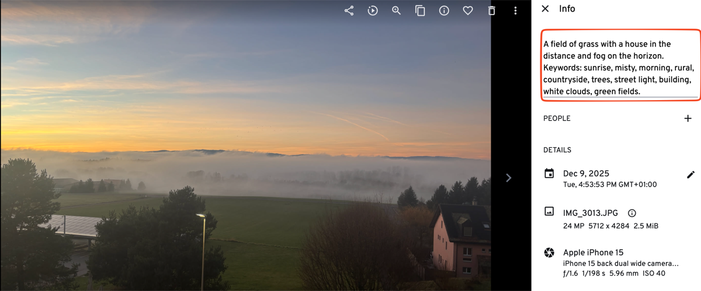
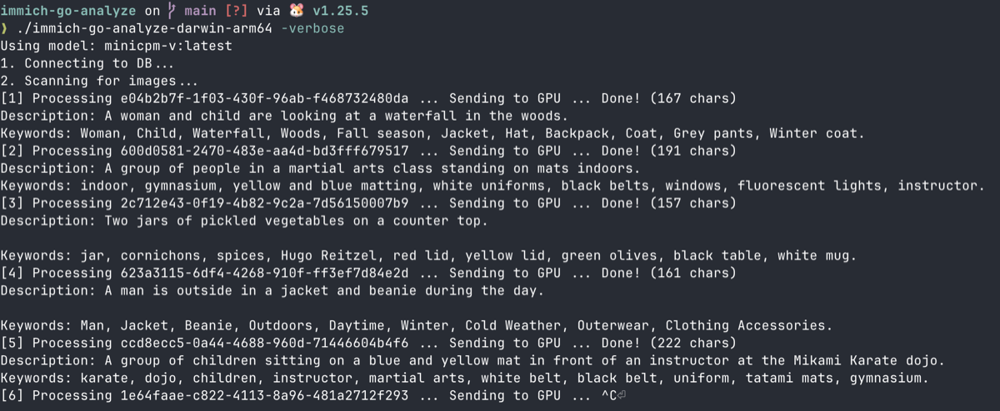

# Immich AI Tagger: Smart Search & Auto-Captioning

A privacy-focused CLI tool that brings **Google Photos-level search** to your self-hosted **[Immich](https://immich.app/)** instance.

It uses local **[Ollama](https://ollama.com/)** vision models (like `minicpm-v` or `moondream`) to automatically analyze your photos, generating concise **captions** and rich **keywords**. This fixes the "no results found" problem by populating your image descriptions with searchable terms like objects, colors, actions, and settings.

## Features

- **Automated AI Tagging:** Scans your library and fills in missing descriptions for thousands of images.
- **Smart Search Optimization:** Prompts the AI to generate keyword-rich descriptions (e.g., "birthday party", "sunset beach", "red car"), making your Immich search bar actually useful.
- **Privacy First:** Runs 100% locally on your machine/server. No data leaves your network.
- **WebP & Format Support:** Automatically handles Immich's thumbnails (including WebP) by converting them on-the-fly for maximum model compatibility.
- **Model Benchmarking:** Compare different models (`qwen3-vl`, `moondream`, `minicpm-v`) to find the best speed vs. quality balance for your hardware.

## Examples

See the tool in action:





## Prerequisites

1.  **Ollama:** Running and accessible.
    *   Pull the recommended model: `ollama run minicpm-v`
2.  **Immich:** A running instance with Database access (Postgres).
3.  **(Optional) Go:** Only required if building from source.

## Installation

### Option A: Download Binary (Recommended)
1.  Go to the [Releases](https://github.com/seconion/immich-go-analyze/releases) page.
2.  Download the binary for your OS (e.g., `immich-go-analyze-linux-amd64`).
3.  Make it executable (Linux/Mac):
    ```bash
    chmod +x immich-go-analyze-linux-amd64
    ```

### Option B: Build from Source
1.  Clone the repository:
    ```bash
    git clone https://github.com/yourusername/immich-go-analyze.git
    cd immich-go-analyze
    ```
2.  Install dependencies:
    ```bash
    go mod download
    ```
3.  Build:
    ```bash
    go build -o immich-go-analyze main.go
    ```

## Configuration

### Environment Variables

1.  Create a `.env` file in the same directory as the binary/source code.
2.  Copy the example content:
    ```bash
    cp .env.example .env
    ```
    *(Or manually create it with the following)*:
    ```ini
    IMMICH_HOST=192.168.1.100
    IMMICH_API_KEY=your_key_here
    DB_HOST=192.168.1.100
    DB_USER=postgres
    DB_PASS=postgres
    DB_NAME=immich
    WATCH_INTERVAL=1m
    ```

### Exposing the Database Port

By default, the Immich PostgreSQL database is **not exposed** outside the Docker network. To allow this tool to connect, you need to expose port 5432 in your Immich `docker-compose.yml`:

1.  Locate your Immich docker-compose file (commonly at `homelab/stacks/immich-app/docker-compose.yml` or similar).
2.  Add the `ports` section to the `database` service:
    ```yaml
    database:
      container_name: immich_postgres
      image: ghcr.io/immich-app/postgres:14-vectorchord0.4.3-pgvectors0.2.0@sha256:...
      ports:
        - 5432:5432
      environment:
        POSTGRES_PASSWORD: ${DB_PASSWORD}
        POSTGRES_USER: ${DB_USERNAME}
        POSTGRES_DB: ${DB_DATABASE_NAME}
    ```
3.  Restart the Immich stack:
    ```bash
    docker compose down && docker compose up -d
    ```

**Security Note:** Only expose the database port if you trust your local network. For remote access, consider using SSH tunneling or VPN instead of exposing the port publicly.

## Usage

Replace `./immich-go-analyze` with `go run main.go` if running from source.

### Run Normally
Process all images without descriptions (in batches of 100):
```bash
./immich-go-analyze
```

### Run Benchmark
Test 5 recent images against multiple models to see speed/quality comparison:
```bash
./immich-go-analyze -benchmark
```

### Watcher Mode (Cron/Service)
Keep running and check for new images every minute (configurable via `WATCH_INTERVAL` or `-interval`):
```bash
./immich-go-analyze -watch
```

### Custom Flags
Override `.env` settings via CLI:
```bash
./immich-go-analyze -host 10.0.0.50 -model moondream:latest -watch -interval 30m
```

## Recommended Models

*   **`minicpm-v:latest` (Default):** Best all-rounder. Fast (~2-4s) and follows instructions well to generate keyword lists.
*   **`moondream:latest`:** Ultra-fast (<1s), good for basic descriptions, but less detailed keywords.
*   **`qwen3-vl:latest`:** Very detailed but slow (~20-30s). Good if you have a powerful GPU.

## Troubleshooting

*   **"Model runner ... unexpectedly stopped":** This usually happens with WebP images on models that don't support them. This tool handles the conversion automatically, so ensure you are running the latest version of this code.
*   **DB Connection Error:** Ensure you are using the correct Postgres port (default 5432) and that your firewall allows connections from this tool to the DB container.
